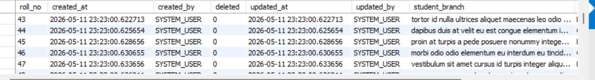
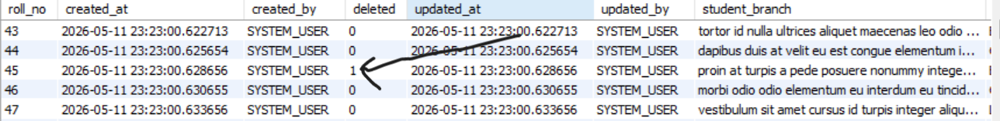

# Student Management System API

A Spring Boot REST API for managing student records with support for CRUD operations, pagination, sorting, CSV import, auditing, filtering, and API documentation using Swagger/OpenAPI.

---

## Features

- Student CRUD operations
- Pagination & sorting
- Search/filter students
- CSV file upload and import
- DTO pattern implementation
- MapStruct entity mapping
- Request logging filter
- CORS configuration
- Swagger/OpenAPI documentation
- MySQL database integration
- Environment variable configuration
- Auditing support:
  - `createdAt`
  - `updatedAt`
  - `createdBy`
  - `updatedBy`

---

## Technologies Used

- Java 21
- Spring Boot 3.3.2
- Spring Web
- Spring Data JPA
- Hibernate
- MySQL
- MapStruct
- Apache Commons CSV
- Swagger/OpenAPI
- Maven

---

## Project Structure

```bash
src/main/java/com/fazil/learn_spring/learnspring_jpa
│
├── controller
├── service
├── repository
├── entity
├── dto
├── mapper
├── utils
├── filters
├── configuration
└── auditing
```

---

## API Endpoints

### Student Endpoints

| Method | Endpoint | Description |
|--------|-----------|-------------|
| GET | `/api/students/all` | Get all students |
| GET | `/api/students/{rollNo}` | Get student by roll number |
| GET | `/api/students/page/all` | Get paginated and sorted students |
| GET | `/api/students/page` | Get students by grade |
| GET | `/api/students/pageResponse` | Get paginated response |
| GET | `/api/students/{name}/{percentage}` | Get students by name or percentage |
| GET | `/api/students/NameAndStudent` | Get students by name and percentage |
| POST | `/api/students/add` | Create a student |
| PUT | `/api/students/update/{id}` | Update a student |
| DELETE | `/api/students/delete-student/{id}` | Delete a student |
| POST | `/api/students/upload-file` | Upload CSV file |

---

## Pagination & Sorting

The API supports pagination and dynamic sorting for efficient data retrieval.

### Example Request

```http
GET /api/students/page/all?page=0&size=5&sortByPARAMETER1=percentage&sortByPARAMETER2=name
```

### Query Parameters

| Parameter | Description |
|------------|-------------|
| `page` | Page number |
| `size` | Number of records per page |
| `sortByPARAMETER1` | First sorting field |
| `sortByPARAMETER2` | Second sorting field |

### Example Response

[page response](learnspring-jpa/screenshots/page_response.png)

- you can see the parameters for page viewing page = 4, size = 10 on Query parameters on API tester Insomnia

### Benefits

- Improves API performance
- Reduces large payload responses
- Supports scalable data retrieval
- Allows flexible sorting

## CSV Import

The project supports importing student data from CSV files using a custom `CSVImportService`.

### Example CSV Format
I used AI to generate data based on  my requirements or entity(Student)
```csv
rollNo,name,percentage,branch
1,Claus,56,tellus semper interdum mauris ullamcorper purus sit amet nulla quisque arcu libero rutrum ac lobortis vel
2,Ellissa,39,laoreet ut rhoncus aliquet pulvinar sed nisl nunc rhoncus dui vel
```

## Request Logging Filter

The application includes a custom request logging filter to monitor incoming HTTP requests.

### Logged Information

- HTTP method
- Request URI
- Request processing details
- Client request information

### Example Log Output

```bash
REQUEST METHOD: GET
REQUEST URI: /api/students/all
TIME: 2026-05-15T10:30:00
```

[Logging request](learnspring-jpa/screenshots/logging_request_filter)

### Purpose

- Helps debugging APIs
- Monitors incoming requests
- Improves backend observability
- Assists during development and testing

### Upload Endpoint

```http
POST /api/students/upload-file
```

---
This is for uploading files to the system and is saved in uploads/ folder

## Swagger/OpenAPI Documentation

Swagger UI is integrated using SpringDoc OpenAPI.

Access documentation at:

```bash
http://localhost:8080/swagger-ui/index.html
```

---

## Environment Variables

Sensitive credentials are configured using environment variables instead of hardcoding them in the project.

### application.properties

The environment variables are configured in the IDE Run Configuration environment settings before starting the application.

Example variables:

```properties
spring.datasource.username=${DB_USER}
spring.datasource.password=${DB_PASSWORD}
```
---
This approach improves security and prevents exposing sensitive credentials in source code or GitHub repositories.

## Database Configuration

Example MySQL configuration:

```properties
spring.datasource.url=jdbc:mysql://localhost:3306/studentdb

spring.jpa.hibernate.ddl-auto=update
spring.jpa.show-sql=true
```

---

## Auditing

The application includes basic auditing functionality to automatically track entity lifecycle events.

### Auditing Fields

- `createdAt`
- `updatedAt`
- `createdBy`
- `updatedBy`

This helps track when records were created or modified and by whom.

---

## Soft delete implementation
The project uses soft delete mechanism instead of permanently removing records from the database.

### How it works
When a student is deleted:
- The record is **not physically removed** from database.
- A boolean flag such as 'deleted' is updated instead.






## Running the Project

### Clone Repository

```bash
git clone https://github.com/your-username/student-management-system-api.git
```

### Navigate Into Project

```bash
cd student-management-system-api
```

### Build Project

```bash
mvn clean install
```

### Run Application

```bash
mvn spring-boot:run
```

---

## Testing the API

You can test the endpoints using:

- Swagger UI
- Postman
- Thunder Client

---

## Key Concepts Implemented

- REST API development
- Layered architecture
- DTO pattern
- Pagination & sorting
- CSV processing
- File upload handling
- Hibernate filters
- Request logging
- Validation
- ResponseEntity handling
- Auditing
- Environment variables
- OpenAPI documentation

---

## Future Improvements

- JWT Authentication & Authorization
- Role-based access control
- Unit & integration testing
- Docker support
- Global exception handling
- Frontend integration using React

---

## Author

Fazil Fizo

---
